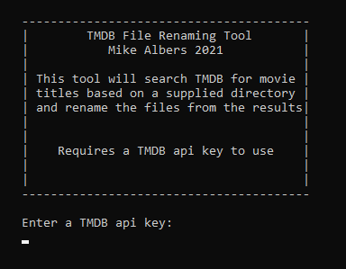
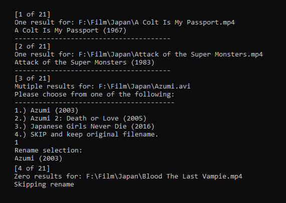
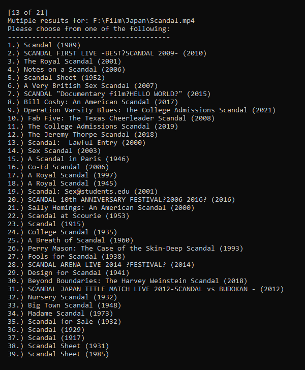
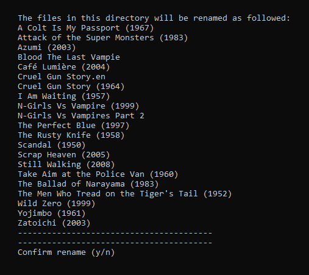
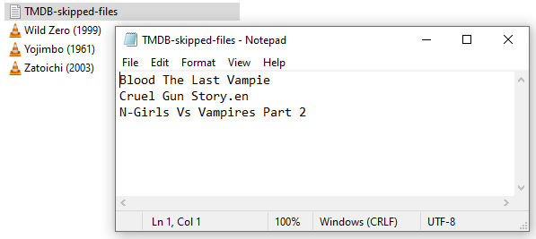

# The Movie Database (TMDB) file rename tool

Simple tool to rename movie files based on results from the TMDB api.
 
https://www.themoviedb.org/

https://developers.themoviedb.org/

### Running the program
Clone or download the repository.

open a console in _tmdb-file-rename-master/tmdb-file-rename_

Enter dotnet run in the console.
`$ dotnet run`

Additionally if you just want a single exe file to run, I've included a publish profile with the repository. It'll make a fairly large exe but you won't have to have any .NET installed.

### Usage
When running, the program will prompt the user for a TMDB api key followed by a prompt for a directory.

After a working api key and directory have been supplied, it will go through the files in that directory and begin formatting the names to search the TMDB api for possible titles.
In this example, you can see that you are provided with a number of the total and what file you are on. 

For each file there are three possible senarios that you can encounter:
1. **One result is found** and the program will automatically pick that result
1. **Multiple results** are found and a list will appear. At this point the user will need to enter a number to pick a title. At the end of every list there is an option to skip renaming in case none of the options are what you are looking for. 
1. **Zero results** are found and the program will automatically **skip** renaming

In some cases, usually when a file has a pretty generic or common title there can be a lot of results. In this case, the correct title was out of view and you would need to scroll through the options

After going through every file, the program will provide a list of all of the chosen options, including any that would have been automatically or manually skipped. Skipped files will keep their original names.
* Confirming with a [Y] will rename the files and create a txt file with a list of all the skipped files to be manually renamed.
* Entering a [N] at this point will exit the program and make no changes

A text file will be created in the directory with a list of all the skipped files.
**TMDB-skipped-files.txt** 

MIT License
Copyright (c) 2021 Michael Albers
